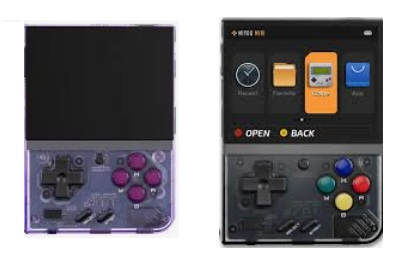

# ⭐ Présentation & Déballage de la Miyoo Mini Plus

On découvre ensemble la Miyoo Mini Plus, une petite console rétro. Je vais te montrer ce qu’elle contient dans la boîte, ce qui est installé dessus par défaut, et pourquoi elle est devenue un incontournable pour les fans d’émulation portable.

# 📺 Vidéo

Lien Youtube: [https://www.youtube.com/watch?v=jyns9jAC-m4](https://www.youtube.com/watch?v=jyns9jAC-m4)

# 🎯 Objectifs de l’épisode

* Découvrir la console : design, ergonomie, écran, boutons.
* Déballer le contenu : console, câble, carte SD, accessoires.
* Comprendre l’OS d’origine : structure de la carte SD, menus, limites.
* Poser les bases pour les épisodes suivants (installation d’OS alternatifs).

# 📦 Matériel nécessaire

* Miyoo Mini Plus

    

# 1. Déballage

* Présentation de la boîte.
* Contenu : console, câble USB-C, carte SD, manuel.
* Première prise en main : poids, texture, qualité des boutons.

# 2. Présentation technique

* Écran IPS 2.8"
* Résolution 640×480
* Batterie 3000 mAh
* Processeur ARM Cortex-A7
* Boutons : D-Pad, ABXY, gâchettes L1/L2/R1/R2

# 3. OS d’origine

* Interface basique : Menus divisés en catégories d'émulateurs sans options de personnalisation avancées.
* Limites : Gestion des sauvegardes sommaire, pas de mise à jour automatique des cœurs RetroArch et organisation des dossiers figée.
* Carte SD fournie : Les cartes micro SD livrées d'origine avec l'OS officiel sont de qualité médiocre et souvent sujettes à la corruption ; il est recommandé de les remplacer par une carte de marque reconnue

# 4. Tests

* Navigation dans les menus.
* Liste des émulateurs préinstallés.
* Structure de la carte SD (dossiers ROMs, BIOS, etc.).
* Limitations de l’OS stock.
